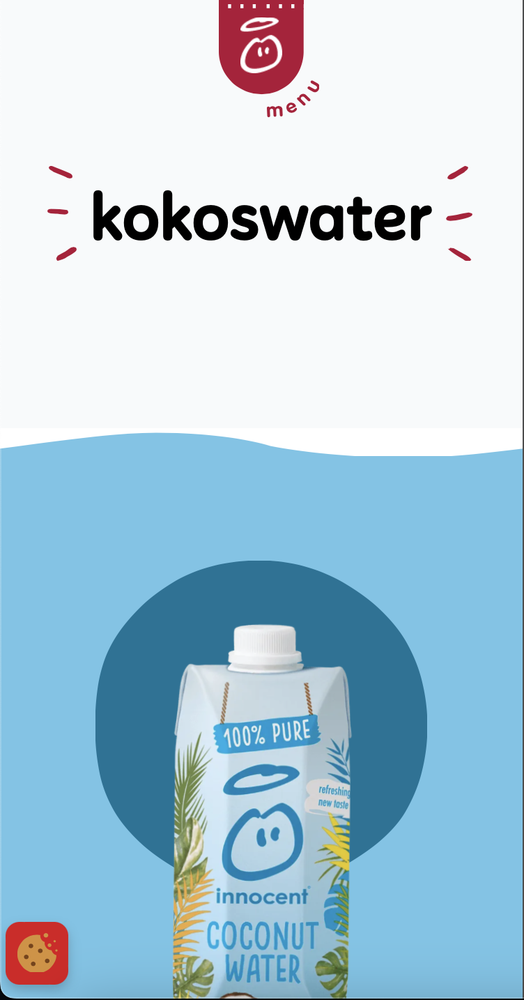

# Procesverslag
Markdown is een simpele manier om HTML te schrijven.  
Markdown cheat cheet: [Hulp bij het schrijven van Markdown](https://github.com/adam-p/markdown-here/wiki/Markdown-Cheatsheet).

Nb. De standaardstructuur en de spartaanse opmaak van de README.md zijn helemaal prima. Het gaat om de inhoud van je procesverslag. Besteedt de tijd voor pracht en praal aan je website.

Nb. Door *open* toe te voegen aan een *details* element kun je deze standaard open zetten. Fijn om dat steeds voor de relevante stuk(ken) te doen.

## Jij

  
uitwerken voor kick-off werkgroep

  ### Auteur:
  Rick Beukman

  #### Je startniveau:
  rood

  #### Je focus:
  surface plane
 

## Je website

  
uitwerken voor kick-off werkgroep

  ### Je opdracht:
  innocentdrinks.nl

  #### Screenshot(s) van de eerste pagina (small screen): 
  Homepage 
  

  #### Screenshot(s) van de tweede pagina (small screen):
  Kokoswater  
  
 

## Toegankelijkheidstest 1/2 (week 1)

  
uitwerken na test in 2e werkgroep

  ### Bevindingen
  Lijst met je bevindingen die in de test naar voren kwamen:

  - screenreader werkte niet volledig. zo was er als je over een button hoverde je niet te horen kreeg dat het een button was en dus ook niet waar het voor diende.
  - over het algemeen vond ik de screenreader heel slecht. Of dit kwam door Apple of omdat ik het zelf nog nooit heb gebruikt.
  - Wel interresant hoe mensen met een beperking een website induiken als het ware.

## Breakdownschets (week 1)

  
uitwerken na afloop 3e werkgroep

  ### de hele pagina: 
  

  ### dynamisch deel (bijv menu): 
  

  ### wellicht nog een dynamisch deel (bijv filter): 
  

## Voortgang 1 (week 2)

  
uitwerken voor 1e voortgang

  ### Stand van zaken
  - font .woff werkte niet. Maakt dit uit welk type het is of hoort dat niet uit te maken?
  - Weet niet zo goed wanneer ik een div/section moet gebruiken.
  - opzetten van HTML ging vrij snel en gemakkelijk.

  ### Agenda voor meeting
  samen met je groepje opstellen

  | student 1      | student 2          | student 3    | student 4        |
  | ---            | ---                | ---          | ---              |
  | dit bespreken  | en dit             | en ik dit    | en dan ik dat    |
  | en dat ook nog | dit als er tijd is | nog een punt | dit wil ik zeker |
  | ...            | ...                | ...          | ...              |

  ### Verslag van meeting
  hier na afloop snel de uitkomsten van de meeting vastleggen

  - Veel h5's 
  - in de footer kan je van de h5 een UL en LI van maken.
  - Als je font niet werkt kan je proberen hem in een mapje te zetten zoals een style.css
  - Zet je script netjes in je head.
  - Goed ingesprongen, semantische code.
  - Alt tekst ligt aan het plaatje hoe gedetaileerd je kan/moet gaan.

## Voortgang 2 (week 3)

  
uitwerken voor 2e voortgang

  ### Stand van zaken
  goed:
  - font downloaden en toevoegen (font wat er op lijkt)
  minder: 
  - foto's downloaden
  - plaatjes centreren
  - section borders
  - fotoslider (oneindig door laten gaan)
  - Menu (in hoe verre klikbaar etc.)
  - wavey border voor bepaalde sections
  

  ### Agenda voor meeting
  samen met je groepje opstellen

  | student 1      | student 2          | student 3    | student 4        |
  | ---            | ---                | ---          | ---              |
  | dit bespreken  | en dit             | en ik dit    | en dan ik dat    |
  | en dat ook nog | dit als er tijd is | nog een punt | dit wil ik zeker |
  | ...            | ...                | ...          | ...              |

  ### Verslag van meeting
  hier na afloop snel de uitkomsten van de meeting vastleggen

  - svg loopen (border)
  - 
  - 
- ...

## Toegankelijkheidstest 2/2 (week 4)

  
uitwerken na test in 9e werkgroep

  ### Bevindingen
  - de voiceover doet het helemaal niet bij mij, ook niet bij andere websites
  - kleur contrast was prima

## Voortgang 3 (week 4)

  
uitwerken voor 3e voortgang

  ### Stand van zaken
  - bestand doet steeds vervelend vanwege de nth:first-of-type etc...
  - sommige plaatjes kan ik niet apart aanspreken hierdoor
  - racket gif is een lange foto, hoe laat ik dit animeren?

  ### Agenda voor meeting
  samen met je groepje opstellen

  | student 1      | student 2          | student 3    | student 4        |
  | ---            | ---                | ---          | ---              |
  | dit bespreken  | en dit             | en ik dit    | en dan ik dat    |
  | en dat ook nog | dit als er tijd is | nog een punt | dit wil ik zeker |
  | ...            | ...                | ...          | ...              |

  ### Verslag van meeting
  hier na afloop snel de uitkomsten van de meeting vastleggen

  - Gif -> screen record
  - plaatje mag class

## Eindgesprek (week 5)

  
uitwerken voor eindgesprek

  ### Je uitkomst - karakteristiek screenshots:
  

  ### Dit ging goed/Heb ik geleerd: 
  De footer was oprecht het enigste wat goed ging in één keer.

  

  ### Dit was lastig/Is niet gelukt:
  Alles, bijna niks doet het. Ik ben meer aan het tellen van sections,divs, articles etc. ipv coderen. Hierdoor was het gwn onmogelijk voor mij om op tijd klaar te zijn. Ik kopieerde letterlijk een section en moest alleen de plaatjes en kleur veranderen, en hij deed het weer niet. 

  

## Bronnenlijst

  
continu bijhouden terwijl je werkt

  Nb. Wees specifiek ('css-tricks' als bron is bijv. niet specifiek genoeg). 
  Nb. ChatGpT en andere AI horen er ook bij.
  Nb. Vermeld de bronnen ook in je code.

  1. ChatGPT
  2. Beetje hulp van me broer, maar niet veel omdat ik toch geen classen mocht gebruiken.
  3. 

